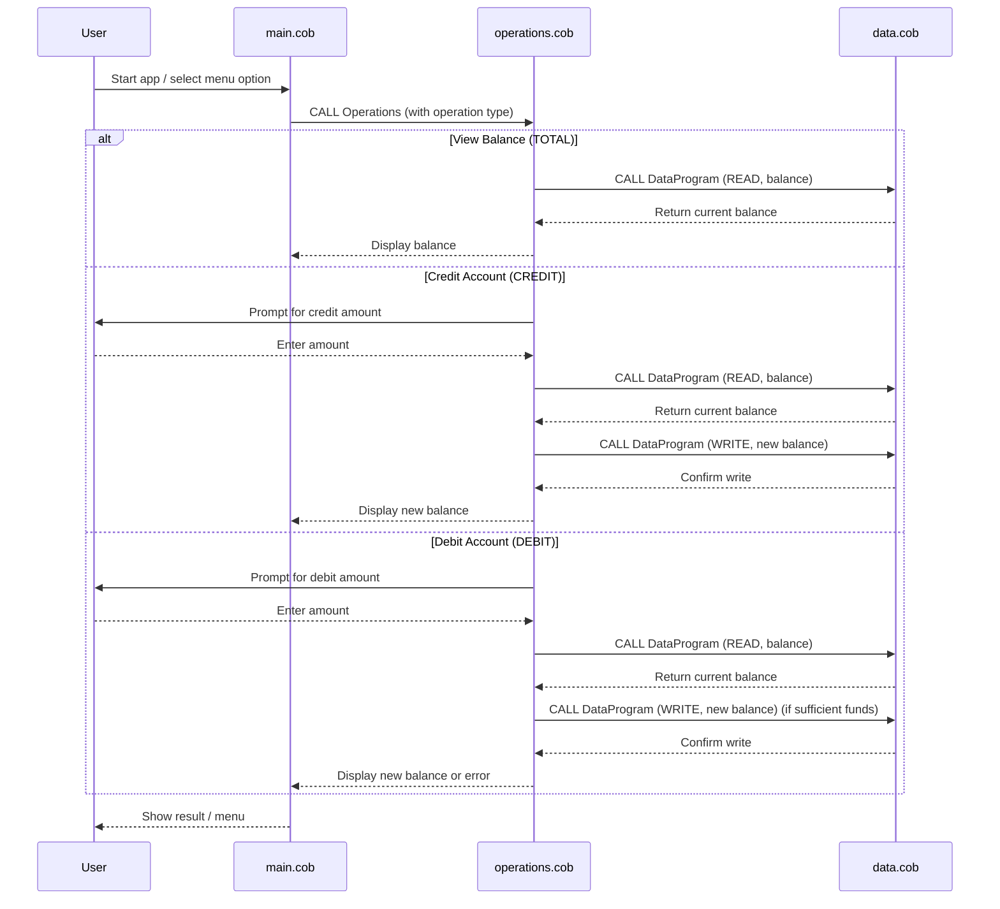

# COBOL Student Account Management System

This project is a simple COBOL-based system for managing student accounts. It demonstrates basic account operations such as viewing balances, crediting, and debiting accounts, with a focus on clear business rules and modular COBOL code.

## Purpose of Each COBOL File

### `main.cob`

- **Purpose:** Entry point and main control loop for the application.

- **Key Functions:**
  - Presents a menu to the user for account operations.
  - Accepts user input to select actions: View Balance, Credit Account, Debit Account, or Exit.
  - Calls the `Operations` program to perform the selected operation.

- **Business Rules:**
  - Only allows valid choices (1-4).
  - Loops until the user chooses to exit.

### `operations.cob`

- **Purpose:** Handles the core business logic for account operations.

- **Key Functions:**
  - Receives the operation type (TOTAL, CREDIT, DEBIT) from `main.cob`.
  - For `TOTAL`: Calls `DataProgram` to read and display the current balance.
  - For `CREDIT`: Prompts for an amount, reads the current balance, adds the amount, writes the new balance, and displays it.
  - For `DEBIT`: Prompts for an amount, reads the current balance, checks for sufficient funds, subtracts the amount if possible, writes the new balance, and displays it. If insufficient funds, displays an error message.

- **Business Rules:**
  - Prevents debiting more than the available balance.
  - Ensures all balance updates are persisted via `DataProgram`.

### `data.cob`

- **Purpose:** Manages persistent storage and retrieval of the account balance.

- **Key Functions:**
  - Receives operation type (READ or WRITE) and a balance value.
  - For `READ`: Returns the current stored balance.
  - For `WRITE`: Updates the stored balance with the provided value.

- **Business Rules:**
  - All balance changes must go through this program to ensure data consistency.

## Business Rules Summary

- Only valid menu options (1-4) are accepted.
- Credit and debit operations require user input for the amount.
- Debit operations are only allowed if sufficient funds are available.
- All balance changes are managed centrally to maintain data integrity.

---

---

## Sequence Diagram: Data Flow

